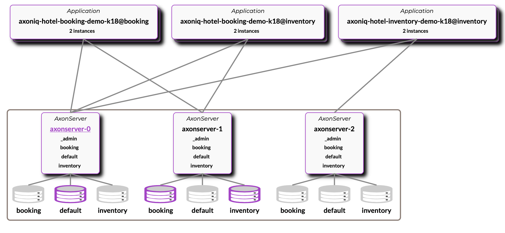
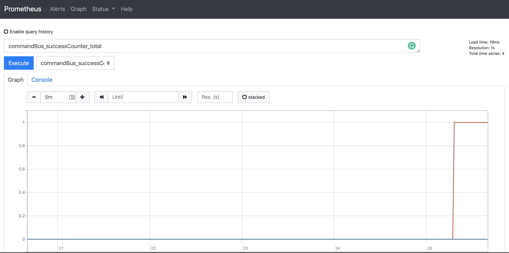
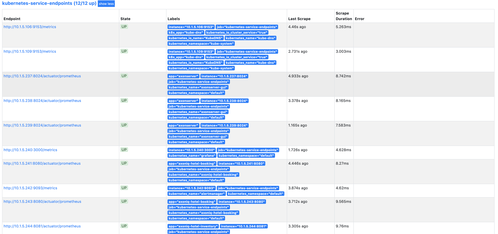
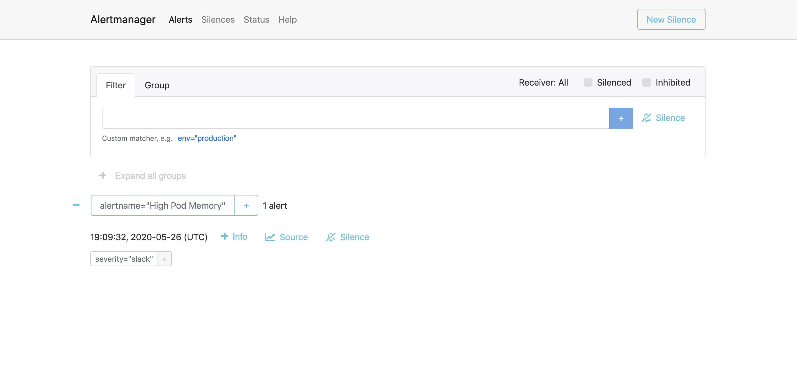
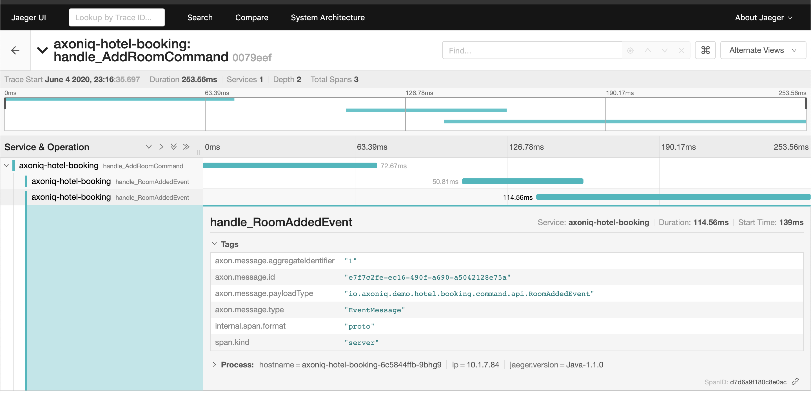

# Kubernetes deployment

Deployment on Kubernetes (CaaS), with [kustomize](https://github.com/kubernetes-sigs/kustomize).

All Kustomize does is merge various YAML files into one.

We will have three environments:

- `Base`: contains a set of YAML configuration on which other environments can be based on
- `Standard`: extends base, will add AxonServer SE ...
- `Enterprise`: extends base, will add AxonServer EE ...

## Build application and Docker image to local Docker Daemon

[Jib](https://github.com/GoogleContainerTools/jib) builds optimized Docker and OCI images for your Java applications without a Docker daemon

```bash
mvn clean verify jib:dockerBuild
```

[Kustomize](https://kubernetes.io/docs/tasks/manage-kubernetes-objects/kustomization/#overview-of-kustomize) is a tool for customizing Kubernetes configurations. It is part of the `kubectl`.

## Apply `Standard` configuration

You can run the following command to start your application(s) with `standard` (Axon Server SE) edition:

```bash
kubectl apply -k .k8s/overlays/standard/
```

- Axon Server Dashboard: [http://localhost:8024](http://localhost:8024)
- Prometheus: [http://localhost:30000](http://localhost:30000)
- Alert manager: [http://localhost:31000](http://localhost:31000)
- Grafana: [http://localhost:32000](http://localhost:32000) (username: admin, password: admin)
- Booking application: [http://localhost:8080](http://localhost:8080)
- Inventory application: [http://localhost:8081](http://localhost:8081)

#### Delete `Standard` configuration

```bash
kubectl delete -k .k8s/overlays/standard/
kubectl delete pvc --all
```

## Apply `Enterprise` configuration

**Make sure you have correct license file configured in [.k8s/overlays/enterprise/axonserver/axonserver-enterprise-secret.yml](.k8s/overlays/enterprise/axonserver/axonserver-enterprise-secret.yml)**

Make sure you have access to AxonIQ docker registry:

```bash
gcloud auth configure-docker
docker pull eu.gcr.io/axoniq-devops/axonserver-enterprise:4.4.3
```

You can run the following command to start Axon Server EE edition:

### Axon Server

```bash
kubectl apply -k .k8s/overlays/enterprise/axonserver
```

Additionally, you have to forward the port 8024 for the GUI service:

```shell script
kubectl port-forward service/axonserver-gui 8024:8024
```

Axon Server Dashboard: [http://localhost:8024](http://localhost:8024) (username: `admin` ; password: `admin`)


> Once AxonServer is running and ready, start the applications:

### Applications

You can run the following command to start your application(s) with `enterprise` (Axon Server EE) edition:

```bash
kubectl apply -k .k8s/overlays/enterprise/applications
```

- Booking application: [http://localhost:8080](http://localhost:8080)
- Inventory application: [http://localhost:8081](http://localhost:8081)



### Prometheus

- Prometheus: [http://localhost:30000](http://localhost:30000)




### Alert manager

- Alertmanager: [http://localhost:31000](http://localhost:31000)



### Grafana

- Grafana: [http://localhost:32000](http://localhost:32000) (username: admin, password: admin)

#### General Spring Boot Dashboard


#### General Axon (Spring Boot) Dashboard


### Jaeger (tracing)

- Jaeger: [http://localhost:32100](http://localhost:32100)



#### Delete `Enterprise` configuration

```bash
kubectl delete -k .k8s/overlays/enterprise/axonserver/
kubectl delete -k .k8s/overlays/enterprise/applications/
kubectl delete pvc --all
```
